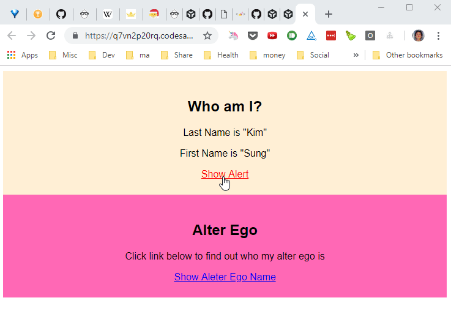

# dangerous


A utility function to create a dangerous/unsafe React component using tagged literal
templates.

The syntax is borrowed from [Styled Components](https://www.styled-components.com/).

`dangerous` returns a component, which uses
[dangerouslySetInnerHTML](https://reactjs.org/docs/dom-elements.html#dangerouslysetinnerhtml)
internally to convert your dangerous input to set literal to DOM's innerHTML
value.

# Requirement ⚠️

Minimum required version of React is v16.3.0 because  `dangerous` uses [React.forwardRef](https://reactjs.org/docs/react-api.html#reactforwardref), which was [introduced in v16.3.0](https://reactjs.org/blog/2018/03/29/react-v-16-3.html#forwardref-api).

## Installation

```sh
$ npm i dangerous
# or
$ yarn add dangerous
```


# 👨‍💻 Example

```javascript
const DangerousComponent = dangerous.div`
  <h1>Who am I?</h1>
  <p>Last Name is "${props => props.lastName}"</p>
  <p>First Name is "${props => props.firstName}"</p>
  <a href="javascript:alert('${({ firstName, lastName }) =>
    `Hi ${firstName} ${lastName}`}');">Show Alert</a>`;


function App() {
  return <Dangerous firstName="Sung" lastName="Kim" />;
}
```

[](https://codesandbox.io/s/x7ymrzw88q)

Code above will display the following and clicking on "Show Alert" link will show an alert.




# To Do
1. Create a GitHub project for version 1.
    1. Add TypeScript types
    1. Add TypeScript definition files to distribution
    1. Add tests
1. Update Logo to look as stylish as that of Styled Components's. 😄
